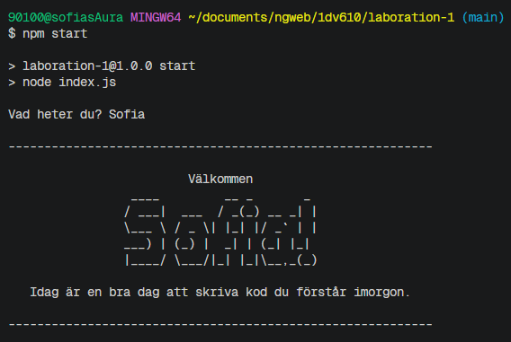

# Reflektion: Laboration 1 – Fortsätt programmera

<!--
    Komplettera filen och lämna in den tillsammans med din MR.
-->

## 1. Att fortsätta programmera

*Vilka kunskaper och färdigheter från tidigare kurser bygger du vidare på i den här uppgiften? Vad var mest utmanande? Vad vill du utveckla vidare i din programmering framöver?*

Svar:
- JavaScript och Node.js
- `npm` och externa paket
- funktioner och array-metoder
- Git och commits
- felsökning genom att köra programmet flera gånger med olika inputs
- att läsa och förstå felmeddelanden i terminalen

Det mest utmanande var egentligen att bara komma igång igen efter sommaruppehållet, eftersom jag inte hållit igång med programmering så mycket som jag hade planerat. Samtidigt känns det som att mycket av kunskaperna börjar vakna till liv igen när jag väl kommer igång.

Jag vill utveckla alla mina kunskaper inom programmering, men framförallt vill jag bli bättre på mer traditionell felsökning. Jag vill i mån av tid försöka undvika fällan att direkt ta hjälp av AI för att få fram lösningen, och istället först försöka förstå problemet och hitta lösningen själv.

## 2. Arbetsflödet

*Hur kändes det att arbeta med Git och använda kursens plattformar?*

Svar:

Det kändes inte som några större problem eftersom jag har vana av att arbeta med både Git och GitLab. Jag har använt GitLab mer tidigare, eftersom det är det som använts i kurserna, men jag känner mig även bekväm med GitHub. Därför var det inga större svårigheter att använda det i den här laborationen.

*Varför valde du GitLab eller GitHub för din kod? Vad vägde du in — till exempel integritet, att bygga en publik portfolio, eller vana? Om GitHub — länk till ditt repo:*

Svar:

Jag valde GitHub eftersom vi framöver kommer att använda det i kursen, och det kändes rimligt att börja använda det redan från början. Jag hade dessutom redan ett GitHub-konto och en fungerande SSH-konfiguration, vilket gjorde valet enkelt.

https://github.com/Fielifia/1dv610-laboration-1

## 3. Bedömning och att dela publikt

*Uppgiften bedöms inte på kodens stil eller kvalitet, bara på en komplett inlämning. Påverkade det hur du arbetade? Och hur kändes det att posta din skärmdump/video publikt i Zulip, utan möjlighet att göra det privat?*

Svar:

Jag har en tendens att "övergöra" saker, så den här gången har jag aktivt försökt att hålla mig till det som faktiskt krävs. Samtidigt ville jag göra något som jag inte hade gjort tidigare, så jag valde att experimentera med ASCII-art. Från början försökte jag få till en ram/skriftrulle med egen kod, men i slutändan valde jag att använda ett externt npm-paket för att få användarens namn i ASCII, utan att göra uppgiften större än nödvändigt.

Det känns väl helt okej att dela resultatet publikt i Zulip, men samtidigt lite jobbigt eftersom resultatet i den här laborationen inte riktigt speglar vad jag i vanliga fall hade presenterat.

## 4. Ditt program

*Vilket programmeringsspråk valde du, och varför just det?*

Svar:

JavaScript för att det är det jag känner mig mest bekant med och har använt mycket i tidigare kurser.

*Vad gjorde du för att göra välkomstmeddelandet till något mer än bara `"Hej " + namn`?*

Svar:

Jag har följt uppgiftens beskrivning och låter användaren skriva in sitt namn. Sedan skriver programmet ut en välkomsthälsning och använder Figlet för att göra namnet till ASCII-art, som skrivs ut på raden efter. Jag har även skapat en array med 20 olika programmeringsrelaterade meddelanden som slumpas fram och visas under välkomsthälsningen. Hälsningen och meddelandet är centrerade, och bredden anpassas dynamiskt efter innehållet.

## 5. AI-samarbete

*Samarbetade du med någon AI-assistent (t.ex. ChatGPT, GitHub Copilot, Claude) — som en kollega snarare än bara ett verktyg? Beskriv kort hur, och ge gärna ett exempel på en prompt som gav ett bra resultat.*

Svar:

Jag använde ChatGPT som en slags handleade under arbetet. Jag började med att försöka lösa delar av programmeringen själv och använde AI för att få ledtrådar, diskutera olika lösningar och förstå problem som jag stötte på. När jag körde fast eller ville gå vidare bad jag ibland om en komplett lösning, som jag sedan gick igenom och anpassade. Jag använde även AI för att diskutera idéer kring programmets utformning och felsökning.

Ett exempel hur jag använda AI var när jag ville **optimera kodstrukturen**. Jag hade först definierat `createGreeting` inuti callback-funktionen och anropade sedan funktionen därifrån. AI föreslog att jag istället kunde låta `createGreeting` ta emot `name` som argument och använda funktionen direkt som callback: `terminal.question('Vad heter du? ', createGreeting)`.

## 6. Bild eller video

*Bifoga (eller länka till) samma skärmdump/video som du postat i Zulip.*

Svar:

